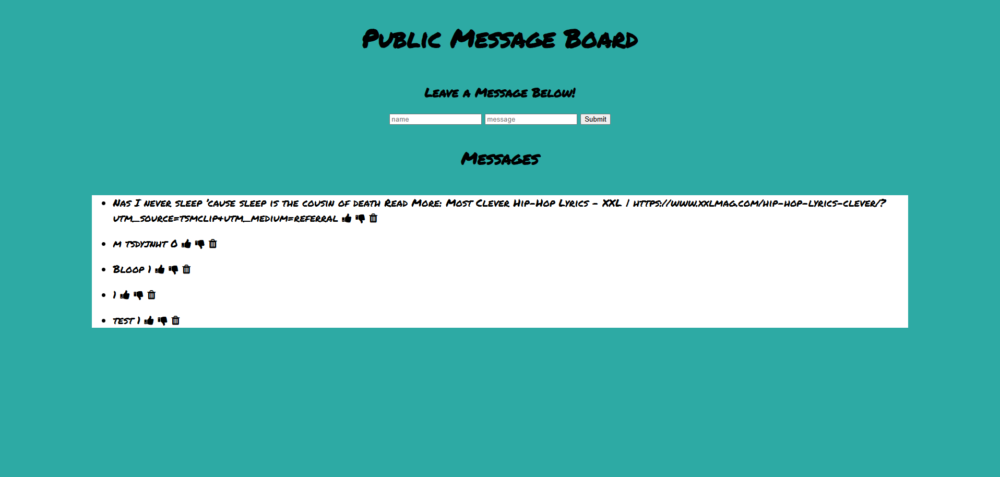

# Public Message Board

Link to project: (https://publicmessageboardapp.onrender.com/)

## How It's Made:
Tech used: EJS, CSS, JS, Node.js, MongoDB

This message board application uses Express for server-side routing and MongoDB for database operations. It allows users to post, like, dislike, and delete messages. Messages are rendered dynamically using EJS templates, while Body-Parser handles incoming JSON and form data. The app features endpoints for CRUD operations, enabling users to interact with the database efficiently.

## Optimizations

- Streamlined the updating process with upsert functionality to handle cases where messages may not exist yet.
- Developed dedicated routes for increasing and decreasing thumbs-up counts to make user interactions more intuitive.
- Improved overall performance and structure by leveraging middleware for static file delivery and input parsing.

## Lessons Learned

- Mastered the use of MongoDB operations to efficiently update and modify specific fields within a document without affecting other data.
- Learned to implement dynamic feedback loops, allowing user actions such as likes/dislikes to immediately reflect on the interface.
- Understood the importance of robust error handling in database operations to ensure a smooth user experience even during failures.

## Installation

1. Clone repo
2. run `npm install`

## Usage

1. run `npm run message` or `node server.js`
2. Navigate to `localhost:3000`
